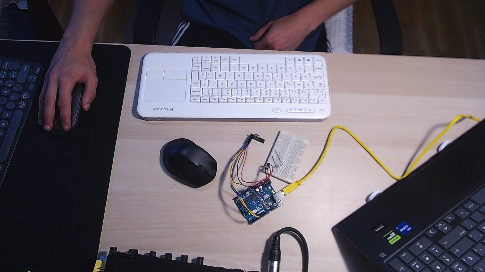
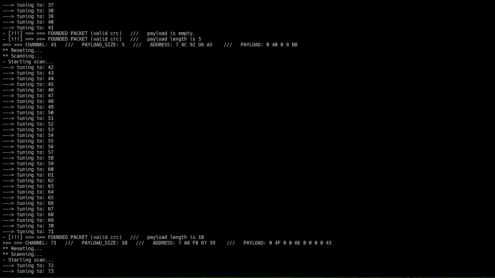

# Investigación preliminar
## MouseJack
#### Germán Quero

---
---

### Introducción

Los ratones y teclados inalámbricos son uno de los dispositivos más populares en el mundo de dispositivos periféricos. Estos se comunicacn en la bada ISM 2.4 Ghz. A diferencia del Bluetooth, no existe un estándard a seguir en comunicaciones de 2.4 GHz, dejando a cada fabricante para implementar su funcionamiento y políticas de seguridad.

Existen una multitud de dispositivos ya investigados con un total de 16 vulnerabilidades descubiertas por Marc Newlin de diversos fabricantes como Logitech, AmazonBasics, Dell, Microsoft, … Estas vulnerabilidades permiten: sniffing, injection, emparejados forzosos, programación de macros maliciosas y DDoS.

Para evitar el espionaje, muchos fabricantes encriptan las señales procedentes del teclado. El dongle conoce la clave de encriptado, por tanto es capaz de descifrarlo antes de comunicárselo al PC a diferencia de un atacante interfiriendo las señales de radiofrecuencia que no conozca dicha clave. A diferencia de los teclados, los ratones no suelen estarlo, en palabras de Logitech: “Since the displacements of a mouse would not give any useful information to a hacker, the mouse reports are not encrypted”

### Transreceptores: Nordic nRF24L01

El nRF24L01 es un transreceptor de radiofrecuencia que opera entre 2.4GHz y 2.5GHz (Industrial, Scientific and Medical, ISM). La velocidad de transmisión alcanza hasta 2 Mbps en una distancia de hasta 100 metros (idealmente). Utiliza modulación por desplazamiento de frecuencia gausiana (GFSK).La topología puede ser punto a punto o multipunto hasta 6 nodos mediante pipes de comunicación, aunque el protocolo soporta hasta 125 canales de comunicación teoricos.

Utiliza un protocolo de comunicación propietario de Nordic (Fabricante del Modulo) llamado ESB (Enhanced Shockburst) el cual no tiene ni encriptaciado ni inmunidad de frecuencia (opera en una sola frecuencia). Existen otros transreceptores utilizados para ratones y teclados como el Texas Instruments CC254X que es comatible con el protocolo de comunicación ESB.

### Enhanced ShockBurst Protocol - ESB

EL protocolo de comunicación propietario de Nordic, utiliza paquetes con la siguiente estructura:

    Preamble: 1 byte
    Address: 3-5 byte
    Packet Control: 9 byte
        Payload Length: 6 byte
        Packet ID: 2 byte
        No ACK: 1 byte
    Payload: 0-32 byte
    CRC: 1-2 byte

Tiene características de retransmisión automática del paquete (si este no ha sido recibido) y auto-ACK.

Antes de continuar investigando acerca de las vulnerabilidades, como identificarlas y explotarlas se consideró prudente tener un primer contacto con estos transreceptore sy su protocolo de comunicación, enviando un mensaje e una arduino a otra mediante esta tecnología. La explicación y los sketch de arduino estan en este [repositorio](https://github.com/germanquero/nrf24l01-arduinoUNO-connect).

### Otros transreceptores

Existen otros transreceptores utilizados para dispositivos de este tipo para los que también han descubierto vulnerabilidades:

- MOSRAT Semicounductor: 2.4 GHz GFSK desencriptado
- Signa SGN6210: 2.4 GHz GFSK desencriptado
- GE Mystery Transceiver: 2.4 GHz GFSK desencriptado

### Logitech Unifying

Unifying es la tecnología propietaria de Logitech para la conexion de dispositivos HID inalambricos en la banda ISM. Esta utliza los nRF24L01 comentados hasta el momento a nivel hardware y una versión modificada del ESB a nivel comunicación. A nivel software utiliza uno con el mismo nombre que la tecnología que permite emparejar y olvidar disositivos nuevos y en algunos casos configurarles ciertas características.

Es una de las comunicaciónes más estandarizadas dentro de este protocolo. Como se mencionó en la introducción, cada fabricante utiliza su adaptación de ESB, a menudo incluso distinta para cada dispositivo. Por esto, una tecnología estandarizada que utiliza un sistema de direccionamiento predecible ha hecho que sea la más explotada en terminos e MouseJack.

Al ser este el caso, va a ser una parte muy central en esta investigación, puesto que estudiar lo concocido se acerca mucho a poder entender cómo funcionan otros protocolos de comunicación y su direcionamiento en el futuro.

La tecnología Logitech Unifying fué utilizada de 2009 a 2021 donde se lanzó Logitech Bolt, su continuación directa. Se desconoce en tanto detalle el funcionamiento de Bolt, pero se sabe que es muy similar y desinada a ser más segura que Unifying. Las 6 vulnerabilidades conocidas desde 2016 de la tecnología Unifying, descubiertas por Marc Newlin, forzaron a la actualización de firmware de esta tecnología en 2017, la cual la gran mayoría de usuarios se cree que nunca aplicó y muy probablemente impulso el desarollo de Logitech Bolt.

#### Direccionamiento

Esta tecnología implementa un esquema de direccionamiento específico que permite conectar hasta 6 dispositivos a un único receptor USB. Las direcciones de comunicación en este sistema siguen un esquema jerárquico y estructurado en tres partes:

- Bytes de Identificación de Fabricante (Primeros 3 Bytes): corresponden a un valor fijo que proviene del semiconductor nRF24L01 y está asignado por el fabricante.
- Identificador Único de Receptor (4º Byte): id único del receptor Unifying. Está grabado en el dispositivo de fábrica.
- Índice de Dispositivo Emparejado (Último Byte): El quinto y último byte de la dirección es un índice que identifica el orden de cada dispositivo conectado al receptor. Este valor comienza en 0x01 para el primer dispositivo emparejado y se incrementa secuencialmente. El 0x00 identifica al receptor.

### SDR vs nRF24L01

En la investigacion que sacó a la luz las 16 vulnerabilidades en disositivos HID inalambricos, Marc Newlin, de Bastille, comenzó analizando e interceptando señales mediante un SDR. Esto se hizo para determinar que caracteristicas del nRF24L01 utiliza cada ratón (velocidad de los datos 1-2Mbps, longitud de la dirección, CRCs, etc.)

Con esto se descubrió que Logitech, sin utilizar cambios de frecuencia en el sentido tradicional, si utiliza cambios de canal, de forma bastante impredecible para evitar interferencias con otros dispositivos de la badna ISM.

Esto da lugar a un problema: los SDR son bastante lentos para resintonizar, lo cual dificulta mucho el análisis, impidiendo a un SDR capturar todo el trafico cuando el dispositivo cambia de canal, puesto que el nRF24L01 resintoniza mucho más rapido.

Aparte, de cara a comunicarse con el receptor, no a analizar, ESB utiliza ACKs para verificar que ha llegad el paquete correctamente. Debido a la latencia, los SDR no pueden enciar ACKs en el tiempo (típicamente 250 ms) admitido po la tenología de Logitech, impidiendo a un SDR simular las interacciones entre el ratón y el receptor.

Por tando un SDR es útil para entender a muy alto nivel como funciona el protocolo de comunicación pero no es una herramienta adecuada para el análisis y mucho menos para la explotación de este tipo de vulnerabilidades.

### Escuchando con nRF24L01: pseudo-promiscuidad

El modo pseudo-promiscuo del nRF24L01 es el nombre utilizado comúnmente para referirse a un modo de sniffing o modo monitor que no está oficialmente soportado en los chips nRF24L01. Esto fue descubierto por Travis Goodspeed y publicado en su blog en 2011.

Esto consiste en ignorar la especificación de Nordic sobre el tamaño de las direcciones, que debe estar entre 3 y 5 bytes, y estableciendo la dirección a 0, causando que el transreceptor deje de filtrar paquetes en función de direcciones especificas y se vuelva receptivo a cualquier paquete cuyo encabezado coincida con el de dispositivos cercanos.

Además, se beneficia de deshabilitar la verificación de CRC (Cyclic Redundancy Check). Este es un mecanismo de identificación de paquetes dañados o incompletos que mejora la fiabilidad de ESB. Deshabilitándolo, permites capturar la mayor cantidad posible de paquetes.

Posteriormente, para evitar el tráfico no deseado y los falsos positivos, se implementa un filtrado manual segun los CRC.

Con esto es una forma sencilla de identificar direcciones de dispositivos en tu entorno que puedan ser vulnerables.

### Buscando una victima: Logitech K400r

En el entorno en el que suele trabajar con el sniffer hay 6 dispotivos potenicalmente vulnerables (determinado a simple vista y verificado más adelante con el sniffer terminado. Se le ha pedido a amigos y familiares con dispositivos vulnerables que no actualicen el firmware hasta que termine la investigación.

Esto permite tener entornos realistas donde probar, puesto que hay numerosos dispositivos; no se elige cuando se encienden o apagan o cuándo envían paquetes (se mueven, hacen click o presionan una tecla).

Sin embargo, se queria tener la posibilidad de relaizar pruebas en un entorno más controlado y manipulable, asique se tenñia que identificar una victima estrategicamente elegida.

Gracias a la investigación de Bastille se dispone de una lista bastante numerosa de dispositios vulnerables. LLama la atención el dispositivo k400r el cual acumula las 6 vulnerabilidades diferentes bajo su nombre en la lista de Bastille y por suerte estaba disponible en el mercado de segunda mano.

### Desarrollando un sniffer de direcciones

Desarrollando un sniffer de direcciones

Conociendo los avances de Marc Newlin y su trabajo con Bastille, se consideró la posibilidad de omitir por completo el apartado de SDR, dado el conocimiento previo sobre la estructura de ESB, los cambios propietarios de Logitech en el protocolo, los cambios de canal y la imposibilidad futura de realizar ataques con este tipo de antenas.

A partir del trabajo de Travis Goodspeed, también se supo que mediante el mismo circuito utilizado en el laboratorio anterior, donde se comunicaron dos Arduinos a través del protocolo ESB, podría crearse un sniffer capaz de escuchar cualquier paquete, de cualquier dirección, en cualquier canal (channel sweep).

Este paso se consideró prudente para profundizar en la investigación, por lo que se procedió a su desarrollo.

Además de Travis Goodspeed y Marc Newlin, se desea destacar el trabajo de Samy Kamkar en su proyecto KeySweeper y el del equipo de Insecurity of Things, así como sus proyectos JackIt y uC-MouseJack (una adaptación para ATmega32u4). Estos proyectos han servido como base para el código y han proporcionado un aprendizaje significativo para la realización de esta parte.

El código se fundamenta en utilizar el modo promiscuo de Travis Goodspeed (0x00 addr, CRC deshabilitado), con las características empleadas por los ratones vulnerables definidos por Marc Newlin (tasa de 2 Mbps, PA deshabilitada, LNA habilitada, tamaño de carga útil de 32). Se escribe directamente en los registros para ciertas configuraciones en lugar de utilizar las funciones de la librería, siguiendo un orden específico para que la librería de Arduino funcione como se espera, tal como fue descubierto por InsecurityOfThings.

Con todo eso configurado, se itera sobre los 82 canales, escuchado durante cierto tiempo. En caso de encontrar un paquete, se comprueba el CRC manualmente bajo una logia muy específica.

Al no utilizar un preámbulo definido para el paquete, se intenta leer el payload y si no pasa el chequeo del CRC, se verifica un bit más adelante, para evitar detecciones que puedan perderse por el desconocimiento de este preámbulo.

Con esta configuración se ha logrado desarrollar un sniffer de paquetes que permite visualizar y enumerar dispositivos vulnerables en el entorno. Hasta el momento, se ha probado con el dispositivo K400r obtenido para la investigación, un ratón K280 cedido para realizar pruebas y se ha verificado lo teorizado acerca de esos 6 dispositivos vulnerables del entorno de trabajo, así como identificado 2 más.

Conclusiones

Desde esta base, se considera que se está bien encaminado para explotar las vulnerabilidades conocidas dentro de la tecnología Logitech Unifying, enumerar otros dispositivos y potencialmente explotar las vulnerabilidades de dispositivos Microsoft, Dell, Lenovo, AmazonBasics, entre otros.

Tras lograr la explotación de vulnerabilidades en los equipos disponibles, se continuará la búsqueda de dispositivos diferentes para poner a prueba la herramienta desarrollada. Posteriormente, mediante un SDR y el sniffer ya creado, se tratará de desglosar y analizar los nuevos protocolos de comunicación y las actualizaciones de software propuestas en busca de nuevas vulnerabilidades.
